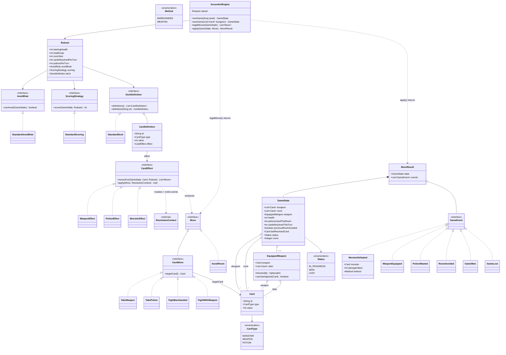
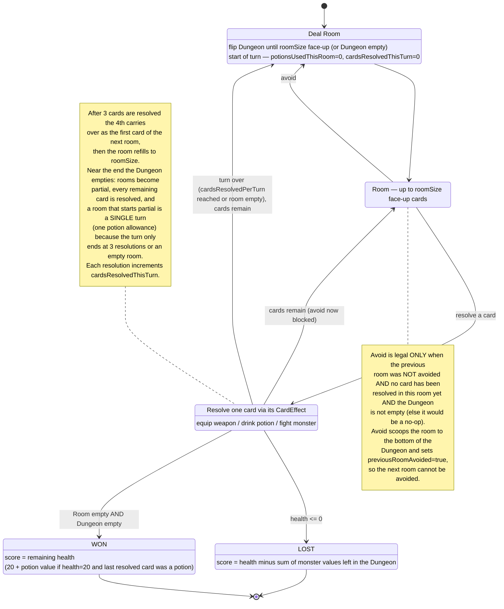
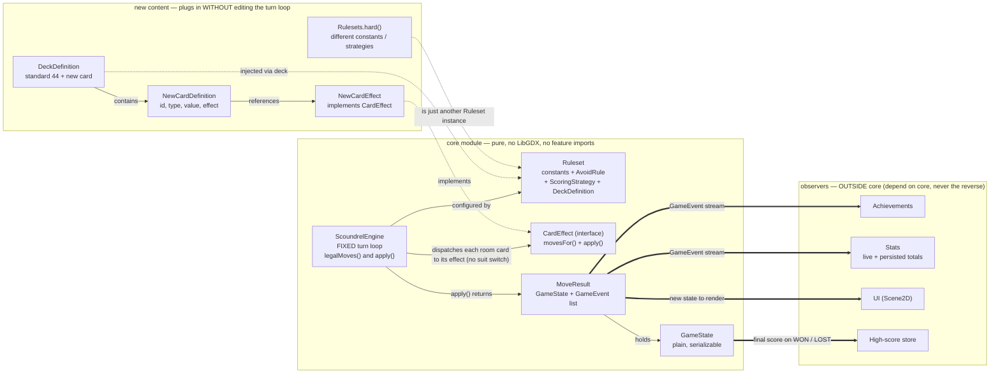

# Scoundrel — Rules Engine Design

Visual reference for the pure rules engine in the `core` module
(`com.tomer.scoundrel.model` = plain state, `com.tomer.scoundrel.rules` = logic).
The diagrams reflect the **approved design** and the rules in
[`../CLAUDE.md`](../CLAUDE.md); the engine is not implemented yet, so this is the
target shape, not a description of existing code.

---

## Detailed design

### Architecture and boundaries

The rules engine is a **pure, headless domain core** with no dependency on LibGDX,
graphics, persistence, achievements, or UI. It lives in two packages:

- `com.tomer.scoundrel.model` — plain, immutable, serializable data: cards, the
  equipped weapon, and the full `GameState` snapshot. No behavior beyond trivial
  derivations; nothing here imports `rules` or anything outside the core.
- `com.tomer.scoundrel.rules` — the logic: card effects, the `Ruleset` and its
  strategies, the `Move`/`GameEvent` types, and the `ScoundrelEngine` that ties
  them together.

This is a hexagonal (ports-and-adapters) layout. The only two "ports" out of the
core are the plain `GameState` value and the `GameEvent` stream returned from
applying a move. The **Dependency Rule** holds: UI, achievements, stats, and the
high-score store depend on the core, never the reverse — the core has no knowledge
they exist. Player actions are pure transforms: `apply(state, move)` returns a
brand-new `GameState` and never mutates its input. Internally the engine uses a
well-encapsulated mutable builder (`ResolutionContext`) for ergonomics, but that
object never escapes a single `apply` call.

### Determinism

The shuffle is seeded: `newGame(long seed)` produces a reproducible dungeon so
tests are repeatable. A second constructor, `newGame(List<Card> orderedDungeon)`,
bypasses the shuffle entirely and lets a test stack the deck (index 0 = top of the
dungeon) to drive an exact scenario. The engine relies only on ordered
collections, so a given (ruleset, seed) always yields the same game. The seed
exists for testing; replays and save-games are out of scope for now.

### The data model

**Cards.** A `Card` is plain data — `record Card(String id, CardType type,
int value)` — where `CardType` is `MONSTER`, `WEAPON`, or `POTION`. Values follow
CLAUDE.md: monsters 2–14 (J=11, Q=12, K=13, A=14), weapons and potions 2–10. All
44 base cards are unique, and a card carries its type and value inline so scoring
and most logic work on plain state without a registry lookup.

**Behavior is data-driven, not a switch on suit.** Every card's behavior lives in
a `CardDefinition(id, type, value, CardEffect effect)`. A `CardEffect` knows two
things: `movesFor(state, card, ruleset)` — which moves this card offers right now —
and `apply(move, ctx)` — how to carry out the chosen move. There are exactly three
base effects: `WeaponEffect`, `PotionEffect`, and `MonsterEffect`. Resolving a card
dispatches to its effect; the engine never inspects suit or type to decide
behavior. Because `GameState` must stay plain and serializable, it stores only the
card's `id`/`type`/`value`; the engine looks the effect up by `id` from the active
ruleset's deck at the moment of resolution.

**The equipped weapon and degradation.** `EquippedWeapon(Card weapon,
List<Card> slain)` keeps the weapon plus the stack of monsters it has slain,
most-recent last. Its degradation state is derived: `threshold()` is the value of
the last slain monster (an `OptionalInt`, empty — no limit — while nothing is slain), and
`canUseAgainst(monster)` is true when the weapon has slain nothing yet or
`monster.value < threshold`. Keeping the whole stack (not just the last value)
preserves the "discard the weapon and its stacked monsters when replaced" wording
and is useful to the UI; the rules read only the last element.

**The game snapshot.** `GameState` is an immutable record holding everything needed
to describe and continue a game:

- `dungeon: List<Card>` — the face-down pile, index 0 = top.
- `room: List<Card>` — the up-to-`roomSize` face-up cards.
- `weapon: EquippedWeapon` — null when nothing is equipped.
- `health: int` — starts at `startingHealth`, capped at `healthCap`, may reach 0 or below.
- `potionsUsedThisRoom: int` — potions taken this turn; compared against the ruleset's `potionsPerTurn` (an int so a variant ruleset can allow more than one heal).
- `cardsResolvedThisTurn: int` — cards resolved so far this turn; the turn ends when it reaches the ruleset's `cardsResolvedPerTurn` (or the room empties). The derived `roomResolutionStarted()` (`> 0`) gates avoiding.
- `previousRoomAvoided: boolean` — true if the immediately preceding room was avoided; enforces "never two in a row."
- `lastResolvedCard: Card` — the most recently resolved card; drives the 20-and-a-potion scoring case.
- `status: Status` — `IN_PROGRESS`, `WON`, or `LOST`.
- `score: Integer` — null until terminal, then the final score.

`GameState` is intentionally a clean, fully-typed record. When future special
cards introduce new state (inventory, resources, status effects), it will be added
as new typed fields — a small, localized change — not through a generic property bag.

### Moves (the action surface)

Player intentions are reified as data (the Command pattern), so the UI and tests
can enumerate and pass them around. `Move` is a sealed interface; card-targeting
moves implement `CardMove`, which exposes `targetCard()`. The five base moves are:

- `AvoidRoom` — scoop the whole room; the only non-card move.
- `TakeWeapon(card)` — equip a weapon.
- `TakePotion(card)` — drink a potion.
- `FightBarehanded(card)` — fight a monster with no weapon.
- `FightWithWeapon(card)` — fight a monster with the equipped weapon.

Keeping `Move` sealed gives the compiler exhaustiveness checking for base
correctness. New special cards normally reuse an existing move; if one ever needs a
genuinely new interaction, a new `CardMove` record is added and routed generically.

### The engine and the turn loop

`ScoundrelEngine` is constructed with a `Ruleset` and exposes `newGame`,
`legalMoves(state)`, and `apply(state, move)` returning
`MoveResult(GameState state, List<GameEvent> events)`. The turn structure is fixed;
everything that varies is injected.

**Legal moves.** `legalMoves` offers `AvoidRoom` when the ruleset's
`AvoidRule.canAvoid(state)` is true, then asks each room card's effect for the moves
it offers (a weapon offers `TakeWeapon`; a potion offers `TakePotion`; a monster
offers `FightBarehanded`, plus `FightWithWeapon` when a weapon is equipped and may
legally be used). The loop never switches on card type.

**Applying a move.** `apply` requires the game to be in progress and the move to be
legal, otherwise it throws `IllegalMoveException`. It then dispatches: `AvoidRoom`
is handled by the engine (a room-level rule); any `CardMove` is delegated to its
target card's effect, which mutates the `ResolutionContext` (health, weapon, room)
and emits semantic events. The engine then runs a fixed post-resolution step.

**Dealing and rooms.** A room is filled by flipping from the top of the dungeon
until it holds `roomSize` cards (or until the dungeon is empty). Dealing a fresh
room starts a new turn: `potionsUsedThisRoom` and `cardsResolvedThisTurn` reset
to 0.

**Combat.** Barehanded, the monster's full value is subtracted from health and the
monster is discarded. With a weapon, damage taken is
`max(0, monsterValue − weaponValue)` and the monster is stacked on the weapon.
**Degradation:** once a weapon has slain a monster it may only be used on monsters
whose value is **strictly less than** (`<`) the last monster it slew — an equal
value is NOT allowed; each use lowers the threshold to the just-slain monster's
value. A monster at or above the threshold simply can't be fought with the weapon —
`legalMoves` won't offer `FightWithWeapon` for it — but the weapon **stays
equipped** for weaker monsters and is never discarded by degradation. A consequence
of the strict comparison: a weapon that slays a 2 (the lowest monster value) can
never be used again, though it remains equipped. Degradation is focused combat logic in the core (not yet
an injected policy).

**Potions.** A potion resolved while fewer than `potionsPerTurn` potions have been
taken this room heals by its value, capped at `healthCap`, and increments
`potionsUsedThisRoom`. Any further potion that turn is discarded and does nothing.
A potion that heals 0 because health is already at the cap still counts as taken.

**Carryover and refill.** If you don't avoid, you resolve cards one at a time. A
turn ends when `cardsResolvedPerTurn` cards have been resolved **or the room
empties**, whichever comes first. In a full room that means three of the four:
the leftover card carries over as the first card of the next room, then the room
refills from the dungeon back up to `roomSize`, beginning a new turn (fresh
potion allowance). A room that *starts* partial (possible only once the dungeon
is empty) therefore plays out as a single turn — its two or three cards share
one potion allowance.

**Avoiding.** Avoiding scoops the whole room to the bottom of the dungeon and deals
a fresh room. It is legal only when the room has not been started (no card resolved
yet), the previous room was not avoided — you may avoid any number of rooms but
never two in a row — and the dungeon is **not empty**. The last guard exists because
a partial room can only occur once the dungeon is empty, and avoiding then would be
a guaranteed no-op: the scooped cards would be re-dealt unchanged. Rather than offer
a move that provably does nothing (and pollutes avoid stats), `StandardAvoidRule`
rejects it. Avoiding sets `previousRoomAvoided` so the next room cannot be avoided;
resolving a card instead leaves that flag false, so the following room may be
avoided again.

**Ending and partial rooms.** Near the end the dungeon empties; rooms then become
partial (1–3 cards) and there is no further carryover — every remaining card is
resolved. The game ends LOST the moment health reaches 0 (the state is frozen
there, no refill), or WON when the dungeon and room are both empty with health
above 0.

### Win, loss, and scoring

Final scoring is an injected `ScoringStrategy`; the base implementation,
`StandardScoring`, encodes CLAUDE.md exactly:

- **Loss** (health ≤ 0): score = `health − (sum of the values of monsters still in
  the face-down dungeon)`, a negative number. Monsters left face-up in the
  unresolved room do **not** count — only the face-down dungeon, per CLAUDE.md's
  wording.
- **Win** (dungeon and room cleared, health > 0): score = remaining health.
  **Special case:** if health is exactly `healthCap` (20) **and** the last resolved
  card was a potion, the score is `healthCap + that potion's value` — the only way
  a score exceeds 20. This holds even if that potion's heal was itself wasted by
  the cap.

### Ruleset and configuration

All constants and swappable rules live in an injected `Ruleset` (a record), so
variations and difficulty are different instances, not new code. It holds the
scalars `startingHealth`, `healthCap`, `roomSize`, `cardsResolvedPerTurn`, and
`potionsPerTurn`, plus three behavioral strategies: `AvoidRule` (when avoiding is
legal), `ScoringStrategy` (final score), and `DeckDefinition` (which cards make up
the deck and how to resolve an id to its definition/effect). A `Rulesets` factory
provides configured instances — `Rulesets.standard()` is base Scoundrel; a harder
variant such as `Rulesets.hard()` is the same record with different field values
(e.g., a lower starting health). Each seam ships with exactly one base
implementation (`StandardAvoidRule`, `StandardScoring`, `StandardDeck`); there is
no plugin framework.

### Events and observers

Applying a move returns the new state **and** the events that occurred, as
`MoveResult(state, events)`. Effects emit semantic events (a monster defeated with
its damage and method, a potion used or wasted, a weapon equipped, a weapon
degraded); the engine emits structural and terminal events (room avoided, room
dealt, game won, game lost). `GameEvent` is a plain interface of record types —
deliberately *not* sealed, so new card effects can emit their own events.
Achievements, live statistics, the persisted aggregate-totals store, and the UI all
observe this stream from outside the core. Because events are returned rather than
pushed through registered listeners, the core holds no references to observers and
stays fully testable ("this move emits exactly these events").

Two observers exist today, both outside the engine: the UI's fading feed, and the
`...scoundrel.runs` package — `RunRecorder` tallies each game's events and
`RunLog` appends the finished run (seed, ruleset id, outcome, score, counters) to
`~/.scoundrel/runs.log` as versioned, tolerantly-parsed key=value lines.

### Extension seams

The design opens exactly the seams the named future features require, and no more:

- **New special cards** (authored in Java): add a `CardDefinition` plus a
  `CardEffect` and include it in a `DeckDefinition`. `legalMoves` asks the new
  effect for its moves and `apply` routes to it through the generic `CardMove`
  branch — the turn loop is untouched. A card needing a brand-new interaction adds
  a new `CardMove` record, still routed generically.
- **Difficulty / variation modes:** construct a different `Ruleset` instance
  (different constants, or a different `ScoringStrategy`/`AvoidRule`/
  `DeckDefinition`). Modes are expected to swap rules within the same
  4-card-room turn shape, which these seams cover; no engine change.
- **Achievements and stats:** observe the `GameEvent` stream live and keep
  persisted aggregate totals — both outside the core. Lifetime totals are sums
  over the per-run counters already persisted in the run log, so no second
  recording system is needed. Stats are implemented: `RunTotals.of(runs)`.
  Achievements are not yet built.
- **High scores:** implemented — the `runs` package records every finished game
  (the engine remains unaware of it); `HighScores` derives the table from the log.

### Edge-case decisions (locked)

1. **Avoiding** is allowed only before any card in the room has been resolved (and never two rooms in a row).
2. **Loss penalty** counts monsters in the **face-down dungeon only**; unresolved face-up room cards are excluded.
3. **20-and-a-potion:** clearing the dungeon at exactly the health cap with the last resolved card being a potion scores `cap + potion value`, even if that heal was wasted.
4. **Weapon degradation** uses strict `<` (a monster of equal value must be fought barehanded); a weapon that can't be used on a given monster stays equipped for weaker ones and is never discarded by degradation.
5. **Partial rooms:** when the dungeon runs low, rooms fill with whatever remains and there is no carryover; all remaining cards are resolved, and clearing them with health > 0 is the win. **Turn boundaries at the end:** a turn ends after `cardsResolvedPerTurn` resolutions *or when the room empties* — so a room that starts partial is one turn (one potion allowance; the standard deck's arithmetic makes every completed game end in a 2-card room), while the lone carryover left after a full room is still its own next room/turn.
6. **Avoiding requires a non-empty dungeon.** With an empty dungeon (partial room, or a full room dealt from the last cards), avoiding would re-deal the exact same cards — a guaranteed no-op — so it is illegal. Equivalently: every legal avoid actually changes the room.

### Deferred seams and tradeoffs

A few seams are intentionally left out until a named feature needs them, to avoid
speculative abstraction: weapon degradation is fixed core logic (it can be promoted
to an injected `CombatRule` when the first rule-swapping mode actually needs it);
`Move` is sealed rather than open (opened only when a special card needs a new
interaction); and `GameState` is a clean fixed record (new state added as typed
fields when inventory/resource cards land, not via a generic bag). The engine also
owns the turn *flow*: variants that reshape a turn (rather than swap rules within
it) would touch the engine — an accepted boundary.

---

## Visual design

**Figure 1 — Model & engine types: a `Card` resolves through its `CardDefinition`/`CardEffect` (no suit switch); `GameState` holds the Dungeon, Room, and degrading `EquippedWeapon`; `apply()` returns a `MoveResult` of new state + events.**

> Events shown are representative; the full set also includes `RoomDealt`,
> `PotionUsed`, and `WeaponDegraded`.

---

**Figure 2 — Turn flow: deal a Room, resolve 3 of 4 (the 4th carries into the next Room), or avoid (never twice in a row, only before resolving), ending in WON or LOST.**

---

**Figure 3 — Extension seams: a new card (definition + effect) and a new `Ruleset` variant plug in without touching the turn loop, while events flow out to observers that live outside `core`.**

> The Dependency Rule: there are no arrows *into* `core`. The engine only emits
> plain `GameState` and a `GameEvent` stream; achievements, stats, UI, and the
> high-score store observe those from outside and are never imported by `core`.
